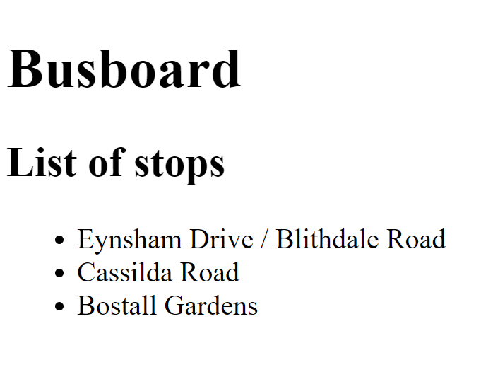
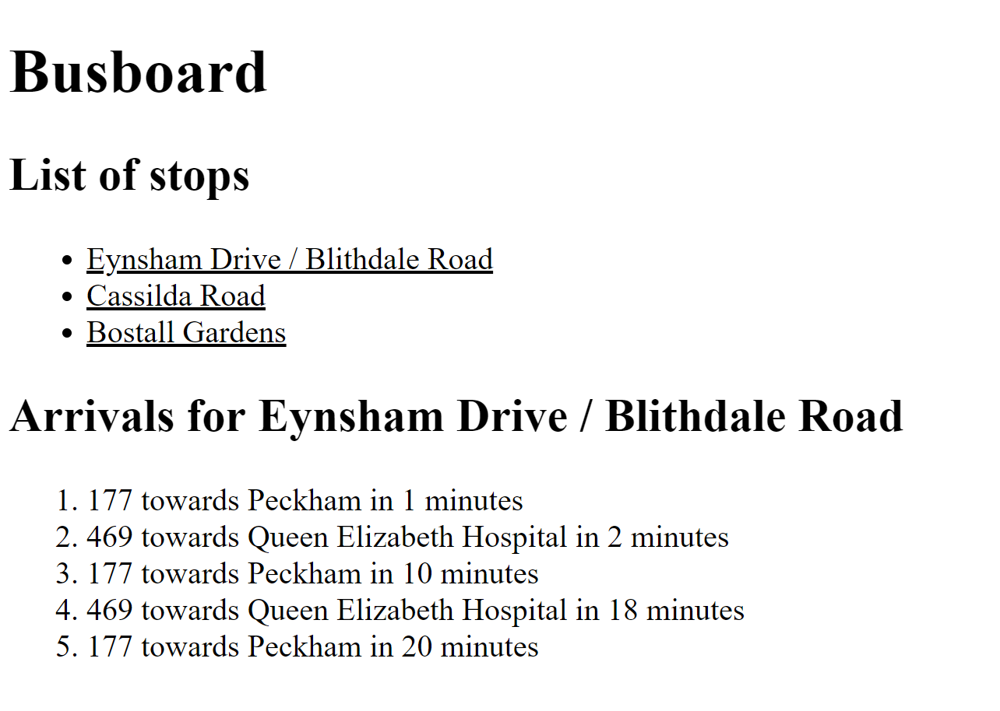

# Busboard Part 2 - Multiple stops

## Aims

In this part, we'll make the page display a list of stops. When the user clicks on a stop, the page will show the details for that stop!

## The List

Let's create a new component that we'll use for showing the list of stops. Generate it in the same way that you generated your component in the previous part. Make sure you give it a good name!

This component should simply display a list of stops - something like this:



The stops won't be real yet, so just make some up!

## User selections

Next, we'll need a way for your users to select a stop by clicking on it. You can react to click events by using the `(click)` attribute in your template like so:

```html
<a (click)="onClick()">Click me!</a>
```

This will call the `onClick` method on your component class, which you'll need to define yourself. Maybe `displayStop()`? You can also pass arguments in to this method - anything you could have used in curly braces `{{}}` you can also use here!

Write a method on your component class that will remember the user's selection when they click on a stop.

## Displaying the arrivals

You already have a `BusStopComponent` that you can use for displaying arrivals, so there's no need to write a new one. This is the beauty of Angular components - you can re-use the same component in lots of different contexts.

You will need to make a change to it, though. Currently the fake stop is hardcoded inside, but we want it to display the stop the user has selected. We'll need to pass the stop into `BusStopComponent`: you can do this using an `Input` binding.

Add in an import of `Input` from `@angular/core` in the component class file, and then define a member variable like this:

```typescript
@Input() stop: Stop
```

This allows you to pass in a value for this member variable using an HTML attribute. It will look something like this:

```html
<app-bus-stop [stop]="selectedStop"></app-bus-stop>
```

Just like before, you can use anything you could have used for curly braces `{{}}` inside the HTML attribute, where `selectedStop` is.

Update your stops component so that when a selection is made, it displays the details for that stop beneath the list:



Try using the `ngIf` directive: attach it to something, and it will completely from it from the DOM if the condition isn't met:

```html
<div *ngIf="condition">This won't display if `condition` is false</div>
```

You should get the drill now, you can replace `condition` with whatever public member variable in the component class, just like for braces `{{}}`.

## Wrapping up

Commit your code, push it to GitHub, and flag down your trainer. Up next, [services](Part3.md)!