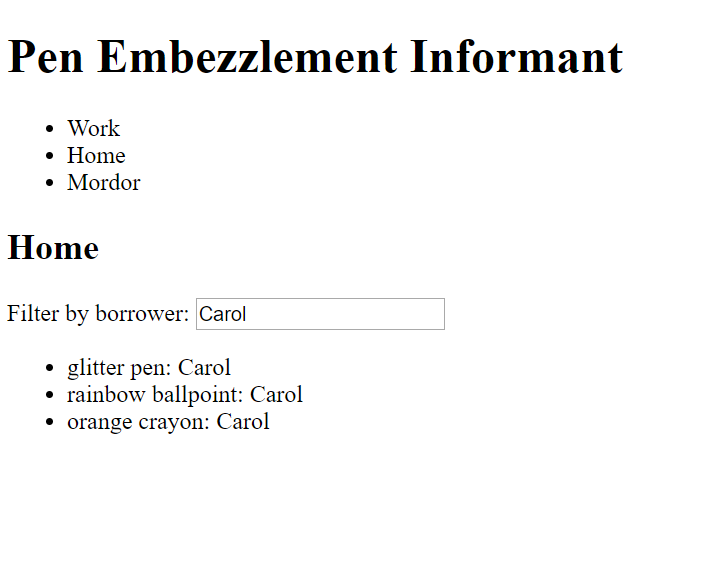

# PEN Part 4 - User input

## Aims

We want to be able to filter by who's borrowed our pens! The user should be able to type in a name and the location details should only display pens that have been lent to that person.

## FormsModule

In order to bind user input to your component classes, you will need to import the `FormsModule` in your app's root module. In `app.module.ts`, add the following line:

```typescript
import { FormsModule } from '@angular/forms';
```

Then add `FormsModule` to the list of `imports` in the module.

```typescript
@NgModule({
  ...
  imports: [
    ...
    FormsModule
  ],
  ...
})
```

## Binding input to your component

Make a public member on your location details component called `borrower`. You can bind the user input to it like this:

```html
<input type="text" [(ngModel)]="borrower">
```

This binds the input field to the member called `borrower`. Any changes the user makes to the `<input>` updates the value of the member automatically.

Update your code so that the user can specify a name and your app will filter out pens to only display pens lent to that person.

>There are many different ways you can achieve this! Here's one potential method.
>
>You might want to use `*ngFor` to loop through the pens and also an `*ngIf` so it's only displayed if the borrower matches. If you try adding both an `*ngFor` and `*ngIf` to the same HTML element, you'll find Angular won't let you! Each element can have at most one *structural directive* (an instruction to Angular to modify the DOM itself).
>
>Our hero here is `<ng-container>`! It lets you create "fake" elements that you can attach extra directives to, but doesn't affect the resulting HTML at all. Give it a try!

When you're done, it will probably look something like this:



## Wrapping up

Commit your code, push it, and flag down your trainer. Up next, the final part, [routing](Part5.md)!

