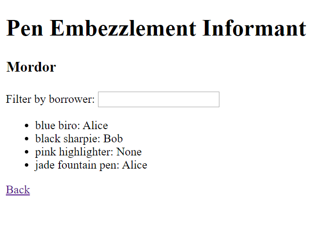

# PEN Part 5 - Routing

## Aims

At the moment, everything in our app happens on a single page. In this part, we'll make the list of locations and the location details appear on separate pages, with different URLs.

In the end, the two pages will look something like this:




## Setting up the router

Angular has a builtin module that deals with routing, but it isn't included in your application by default. It's a bit fiddly to set up, but it's the same every time you do it, so once you've done it once you'll have mastered it. Here are the steps you need to follow to set up the router:

1. Run the command `ng generate module app-routing --flat --module=app`. This generates a routing module, and imports it into your application's root module.

1. Add the line `import { RouterModule, Routes } from '@angular/router'` to the top of your new module.

1. Immediately after the imports, define the routes: something like the following, but of course using your own names for the components:

    ```typescript
    const routes: Routes = [
        { path: '', redirectTo: '/locations', pathMatch: 'full' },
        { path: 'locations', component: LocationsComponent },
        { path: 'location/:id', component: LocationDetailsComponent }
    ];
    ```

1. Remove any reference to providers or declarations, and weave in the following metadata to the `NgModule` decorator:

    ```typescript
    ...
    imports: [
      ...
      RouterModule.forRoot(routes)
    ],
    exports: [
      RouterModule
    ]
    ...
    ```

1. Replace the template in `app.component.html` with the following, which tells Angular where to render the components you are routing to:

    ```html
    <router-outlet></router-outlet>
    ```

You should be all set for routing now! Visit http://localhost:4200 in your browser and check that you're redirected to `/locations`.

>If you look closely at the routes you've defined, you'll see that there's a colon before the `id` segment of the `/location` URL - this means that `id` is the name of a parameter that is used as a placeholder for the actual value that is used there. We'll see how to use that later.

## Add links to your locations component

Since we're going to have a separate page for the pen details, remove the component that displays them from the template of your locations component.

We're also going to need to change the behaviour when a user clicks on a certain location. Rather than just marking it as selected, we now need to link them to the page that contains details for that location.

You can create an Angular router link using HTML like the following:

```html
<a routerLink="/location/{{location.id}}">Clickable link</a>
```

If your location model didn't contain an ID before, you should modify it to include one now.

## Fix your location details component

If you follow one of the links, your component probably doesn't work anymore. That's because previously, it was getting the location information passed through an `Input` binding, whereas now it is being routed to.

You can extract the location ID from the route by injecting an `ActivatedRoute` (import from `@angular/router`) into the constructor of your component. You can then get hold of the ID from the `ngOnInit` method via:

```typescript
activatedRoute.snapshot.paramMap.get('id')
```

>`ngOnInit` is a special Angular method that runs just after a component is constructed. It is the correct place to do any initialisation that your component requires - it is bad practice in Angular to use the constructor for anything other than simply setting some member variables to simple values.

Once you have the ID from the URL, you'll need to actually get hold of the location's details. Create a method in your locations service that gets the details for a single location given its ID, and then inject this service into your component and use it to get the location data.

## Wrapping up

Everything should now be working as before, but with routing in place: navigate around and watch your URL update as you move! Commit your code, push to GitHub, and show your trainer!

## Further work

If you've finished early, why not improve your app? Here are some ideas:

- Prettify the app. At the moment, it probably looks fairly plain. Add some CSS to the `*.component.css` files to spice up the look of your PEN.

- Error handling. I bet there are a few places where error handling could be improved. What if a user navigates to a location that doesn't exist?

- Usability. Is there anything about your app that annoys you as you use it? Can you fix that?